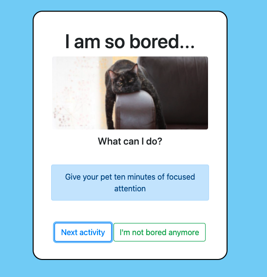

# I AM BORED !!

Bored je webova aplikacia, ktora nam navrhne co mozeme robit ked sa nudime.



## Vasa uloha:

1. Naklonujte tento repozitar
```
git clone https://github.com/branecko/i-am-bored.git
```

2. Vstupte do noveho priecinka `i-am-bored`
```
cd i-am-bored
```

3. Nainstalujte vsetky zavislosti
```
npm install
```

4. Spustite lokalny server:
```
npm start
```

## Do tohto projektu doplnte:

> V tomto projekte budete upravovat subor `App.js`, nie `index.js`!

1. **FUNKCIONALITA**

Nasa aplikacia zatial nie je kompletna. Mala by obsahovat nasledovnu funkcionalitu:
- Zatial zobrazujeme len jednu ulohu, ktora je aktualne uchovana v App.js pomocou `useState()`. Implementujte `onClick` funkcie na buttonoch (co maju robit je napisane pri nich v komentari).

2. **ZISKAJTE INFORMACIE ZO SERVERU**

Stranka boredapi.com nam ponuka API, ktore je zadarmo a pouzijeme ho na ziskanie navrhu aktivity, ktoru nam bude aplikacia zobrazovat. Vyhodou tejto stranky je, ze nemusime riesit ziadnu autorizaciu/povolenia/prihlasovanie ale rovno zavolame url pomocou kniznice axios. Viac informacii najdete v ich dokumentacii: https://www.boredapi.com/documentation

- nainstalujte kniznicu axios `npm install axios`
- importujte axios do nasho projektu (App.js)
- skuste vykonat `GET` request na url `https://www.boredapi.com/api/activity`
- do konzoly skuste vylogovat objekt, ktory vam vrati tento request. Mal by vyzerat priblizne takto:
```
{
  "activity": "Listen to your favorite album",
  "type": "music",
  "participants": 1,
  "price": 0.08,
  "link": "",
  "key": "3136729",
  "accessibility": 0.2
}
```
- (pozn. odpoved zo servera nazvem `data`) ulozte hodnotu z `data.activity` do nasho `useState` v App.js - to vypise hodnotu zo serveru na nasu stranku.
- implementujte toto volanie API, tak aby sa zavolal server a ulozilo hodnotu activity do useState:
  - Automaticky ihned po nacitani aplikacie (pomocka - useEffect + useCallback)
  - Po kliknuti na button (pomocka - onClick)

3. **Kniznica komponentov React-bootstrap**

Komponenty nemusime vytvarat sami. Existuje vela komponentov, ktore casto pouzivame (buttony, nadpisy, input fieldy) a na internete mozeme najst velke mnozstvo kniznic, ktore pre nas vytvorili taketo komponenty. Rozdielom medzi beznym html elementom `<button>` a komponentom (ktory si vytvorime alebo ho niekto vytvoril) `<Button>` je taky, ze komponent moze mat nejake pridanu (doprogramovanu) funkcionalitu a hlavne pekne styly. Pomocou props mozeme lahko menit ako ma tento `<Button >` vyzerat.
```
    <Button variant="primary" size="lg">Click me</Button>
    <Button variant="light">Click me</Button>
```
Velmi zname kniznice su napr.:
- https://react-bootstrap.github.io/
- https://material-ui.com/
- https://ant.design/docs/react/introduce

My pouzijeme react-boostrap:
- mozete pokracovat podla tejto stranky https://react-bootstrap.github.io/getting-started/introduction alebo ja zhrniem par bodov
- nainstalujte si potrebne kniznice (`bootstrap` je cista css/javascript kniznica, ked chceme pouzivat bootstrap, ktory obsahuje react komponenty musime nainstalovat aj `react-bootstrap`)
```
npm install react-bootstrap bootstrap
```
- podla navodu z linku vyssie (treba citat dokumentacie, vela sa z nich dozvieme) pridajte css subor do suboru index.js alebo App.js (tento subor sme stiahli pomocou predchadzajuceho prikazu a je schovany v priecinku `node_modules`). Ak skopirujete nasledujuci riadok, nas projekt vie kde ho ma hladat. (netreba specifikovat cestu do priecinka node_modules)
```
import 'bootstrap/dist/css/bootstrap.min.css';
```
- v App.js importujte button a pouzite
```
    import Button from 'react-bootstrap/Button';
    // alebo
    import { Button } from 'react-bootstrap';
```
- vymente html elementy button za novy komponent Button. Rozne varianty najdete v dokumentacii: https://react-bootstrap.github.io/components/buttons/
```
    <Button></Button> // namiesto <button></button>
```

- precitajte si co vsetko za nas dokaze Bootstrap spravit:
  - pomocou grid vieme lahko navrhnut rozlozenie stranky pomocou riadkov/stlpcov https://react-bootstrap.github.io/layout/grid/
  - zoznam komponentov: https://react-bootstrap.github.io/components/alerts

4. **CSS STYLING** 

Pridajte css styly do tejto React aplikacie. 
- vytvorte css subor napr. `styles.css` alebo `App.css` vo vasom `src` priecinku.
- importujte tento subor do niektoreho `js` suboru (App alebo index)
```
import './styles.css';
```

Teraz mate volnu roku napr:
- farebne pozadie,
- velkosti a farba pisma
- text mozete vycentrovat na stred obrazovky
- kludne si mozete pomocou aj komponentami z react bootstrap
- pridajte aj nejake obrazky. (mozete pouzit html element `` alebo react-bootstrap komponent `<Image>` https://react-bootstrap.github.io/components/images/ )Nizsie je ukazka kodu ako pridat obrazok do React komponentu (jeden obrazok som vam pridaj aj sem do repozitara a vola sa `bored.jpg`)
```
import React from 'react';
import logo from './logo.png'; // import image

export const Header() {
  // Import result is the URL of your image
  return ;
}
```

## CO DALEJ ??
- rozsirte appku o dalsiu funkcionalitu ak chcete (mne sa uz minuli napady)
- skuste ostylovat aj stare ulohy z minulych dni napr. predpoved pocasia
- mozete vytvorit vlastnu appku, ktora bude citat nejake verejne API. nejaky zoznam som nasiel tu: https://mixedanalytics.com/blog/list-actually-free-open-no-auth-needed-apis/
- pozrite sa na oficialny navod na react a skuste si ho spravit: https://reactjs.org/tutorial/tutorial.html 
- ostylujte nasu todo appku (budete mat menej roboty posledny tyzden)
- skusajte skusajte skusajte a nenechajte sa odradit prvotnymi neuspechmi.
- pytajte sa
